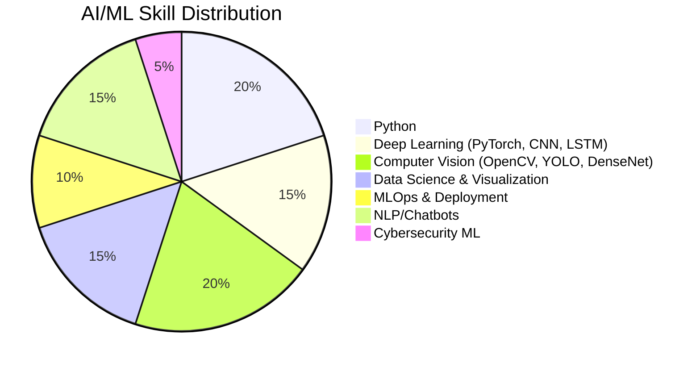

<!-- Profile README for Jehad Ur Rahman -->

# 👋 Hi, I'm **Jehad Ur Rahman**!

  
AI/ML Researcher | Computer Vision | Healthcare AI | Deep Learning |Natural Language Processing

---

## 📃 **About Me**

<table>
  <tr>
    <td>
      I’m an AI/ML researcher with a Master’s in Artificial Intelligence, published work in computer vision, signal processing, and intelligent healthcare systems. My journey bridges academic research and real-world applications, with projects in smart cities, security, disaster prediction, and healthcare.
      <ul>
        <li>🧑‍🔬 <b>Passionate about:</b> AI, ML, DL, Computer Vision, NLP, Intelligent Healthcare, Cybersecurity</li>
        <li>🎓 <b>Aspirations:</b> Pursuing a PhD to advance research in AI, ML, Computer Engineering, Biomedical Engineering, and more</li>
        <li>🔗 <a href="https://jehadkurt-lcvvnl3.gamma.site/">Portfolio Website</a>, <a href="https://www.linkedin.com/in/jehadkurt/">LinkedIn</a>, <a href="https://wa.me/923439176731">WhatsApp</a></li>
        <li>📍 Islamabad, Pakistan</li>
        <li>📧 jehadurrahman@uetpeshawar.edu.pk</li>
      </ul>
    </td>
    <td>
      
    </td>
  </tr>
</table>

## 🛠️ **Skills**

> Main tools:
> Python, PyTorch, Keras, Scikit-learn, OpenCV, FastAPI, Docker, Kubernetes, Cloud (AWS, Azure), Kafka, Apache NiFi, REST APIs, SQL/NoSQL

---

## 🧪 **Work Experience Highlights**
- **AI/ML Engineer at Horizon Tech Services**
  - Developed cybersecurity analytics (UEBA, anomaly detection, REST APIs, SOC integration)
  - Set up data pipelines (Kafka, NiFi, OpenSearch) and real-time detection engines
  - Led MLOps: Containerization, cloud deployment, monitoring (Prometheus, MLflow)
- **Sr. AI Engineer at UET Peshawar – Center of Intelligent System and Network**
  - Invented real-time water quality analysis, disaster management systems, self-evolving chess-bot
  - Achieved 85% accuracy in flood prediction, 6-hour turnaround in E. coli detection
- **Artificial Intelligence Engineer at Qatar University**
  - Developed ML for ECG arrhythmia detection, stress prediction, sleep stage classification
  - Published work with 95%+ accuracy for stress scoring and arrhythmia detection
- **Early Roles:**
  - Jr. AI Engineer, NCAI Trainee, PTCL Internee – AI/NLP, containers, health tech, optical fiber/switching

---

## 📦 **Notable Projects**
- 🚰 **AI-based E. coli & Fecal Contamination Detection**  
- ♟️ **Self-Evolving Chess Bot (Genetic Algorithms)**  
- 👮‍♂️ **Safe City Surveillance Project (Mardan, Pakistan)**  
- 🚗 **3D Object Detection for Autonomous Vehicles (YOLO3D, PointRCNN, KitTI)**  
- 🦠 **COVID-19 Detection from Chest X-rays (DenseNet)**  
- 💓 **ECG Arrhythmia Classification (Deep Learning)**  
- 🏦 **Bankruptcy Prediction GUI (Multiple ML Models)**

---

## 📚 **Selected Publications**
- **Multi-Digit CNNs for Number Recognition [IJIST 2024]**
- **Stress Score Detection Using CNNs from ECG [IJIST 2024]**
- **Home Gas Leak Detection via Vision [IEEE 2025]**
- **Brain Tumor Detection & Classification on MRI [IEEE 2025]**
- **Water Safety: AI-based E. Coli Detection [Accepted, IEEE 2025]**
- **Brain Age Prediction for Alzheimer’s and Parkinson’s [Under Review, Elsevier]**
- **Early AIoT Water Contamination Kits [Under Review, Elsevier]**

---

## 🏆 **Honours & Awards**
- 2nd Place, Quiz Competition (District Higher Schools Tournament, Shangla)
- Best Summer Intern (AI in Healthcare, NCAI)

---

## 🧑‍🎓 **Education**
- **MSc in Artificial Intelligence** (UET Peshawar, 2023–2025)  
  Thesis: AIoT-based Early Detection of E. coli & Klebsiella Aerogenes  
  Final Grade: A1  
- **BSc in Electrical Engineering (Comm.)** (UET Peshawar, 2018–2022)  
  Thesis: Arrhythmia Classification from ECG via DL  
  Final Grade: B+

---

## 🖥️ **Online Certifications**
- Machine Learning (Stanford, Coursera)  
- Deep Learning (DeepLearning.AI, Coursera)  
- Python Programming (University of Michigan)  
- Cybersecurity Tools (IBM)  
- Neural Networks (Analytics Vidhya)  
- Data Science (Cybervision Intl. w/ UNDP)

---

## ✨ **Community, Skills, and Interests**
- **Languages:** Pashto (native), Urdu (C2), English (B2)
- **Societies:** Pashto Literary Society, Pashtun Student Federation, Student Welfare Society, Blood Donors Society
- **Skills:** Negotiation, Teamwork, Leadership, Research, Problem Solving  
- **Tech Interests:** AI agents, LLMs, NLP, Model Deployment, Data Visualization, Signal Processing  
- **Hobbies:** 📚 Reading | 👨‍💻 Python Programming | ♟️ Chess & Cricket

---

## 📢 **Lets Connect!**
- [🌐 Website](https://jehadkurt-lcvvnl3.gamma.site/)
- [💼 LinkedIn](https://www.linkedin.com/in/jehadkurt/)
- [📧 Email](mailto:jehadurrahman@uetpeshawar.edu.pk)
- [📱 WhatsApp](https://wa.me/923439176731)
- [🏢 Location: Islamabad, Pakistan]

---

## 🧠 **Favorite Quote**
> "The best way to predict the future is to invent it." – Alan Kay

---

  
  

---

_**Thanks for visiting! Hit the ⭐️ on interesting repos, and let’s collaborate on AI for good!**_
